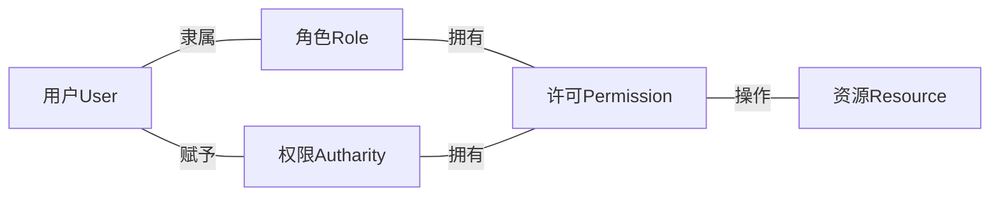

# Auth-demo

> 对于 99% 的系统来说，在安全上不去做轮子，不去想发明创造，严格遵循标准就是最恰当的安全设计。 -- 周志明

## 未来规划

1. 设计好RBAC相关数据模型
2. 接入spring security增加权限认证
3. 接入Oauth2认证流程
4. 接入saml认证流程
5. 尝试增加数据权限校验

## RBAC设计

RBAC应符合以下设计



# LeetCode

- [4. 寻找两个正序数组的中位数](https://leetcode-cn.com/problems/median-of-two-sorted-arrays/)
- [3. 无重复字符的最长子串](https://leetcode-cn.com/problems/longest-substring-without-repeating-characters/)
- [10. 正则表达式匹配](https://leetcode-cn.com/problems/regular-expression-matching/)
- [19. 删除链表的倒数第 N 个结点](https://leetcode-cn.com/problems/merge-k-sorted-lists/)
- [20. 有效的括号](https://leetcode-cn.com/problems/valid-parentheses/)
- [23. 合并K个升序链表](https://leetcode-cn.com/problems/merge-k-sorted-lists/)
- [42. 接雨水](https://leetcode-cn.com/problems/trapping-rain-water/)
- [224. 基本计算器](https://leetcode-cn.com/problems/basic-calculator/)
- [239. 滑动窗口最大值]( https://leetcode-cn.com/problems/sliding-window-maximum/)

# GIT奇技淫巧

## 修改历史所有信息

```git
git filter-branch --env-filter '

OLD_EMAIL="旧的邮箱地址"
CORRECT_NAME="新的名称"
CORRECT_EMAIL="新的邮箱地址"

if [ "$GIT_COMMITTER_EMAIL" = "$OLD_EMAIL" ]
then
    export GIT_COMMITTER_NAME="$CORRECT_NAME"
    export GIT_COMMITTER_EMAIL="$CORRECT_EMAIL"
fi

if [ "$GIT_AUTHOR_EMAIL" = "$OLD_EMAIL" ]
then
    export GIT_AUTHOR_NAME="$CORRECT_NAME"
    export GIT_AUTHOR_EMAIL="$CORRECT_EMAIL"
fi
' --tag-name-filter cat -- --branches --tags
```

```git
git push --force --tags origin 'refs/heads/*'
```

> 如果出现无法变更的错误，需要删掉备份 `rm -rf .git/refs/original`
