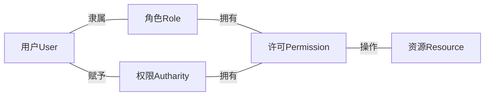

# auth-demo

一个授权demo,随便写写,就当练手了

## 未来规划

1. 设计好RBAC相关数据模型
2. 接入spring security增加权限认证
3. 接入Oauth2认证流程
4. 接入saml认证流程
5. 尝试增加数据权限校验

## RBAC设计

RBAC应符合以下设计

```mermaid
flowchart LR
  用户User-- 隶属 ---角色Role
  用户User-- 赋予 ---权限Autharity
  角色Role-- 拥有 ---许可Permission
  权限Autharity-- 拥有 ---许可Permission
  许可Permission-- 操作 ---资源Resource
```
